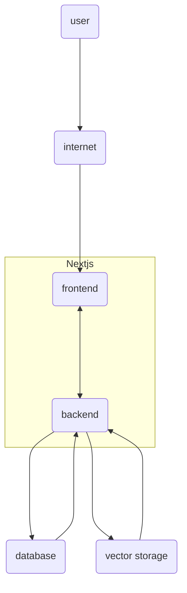

# AI Assistant

## Techstacks

- Nextjs (front-end, back-end, apis)
  - typescript, tailwind, next-auth
- Database (PostgreSQL and prisma)
- storages (vercel bolb)
- deployment (vercel.com)

## highlevel design

## demo app

## use prisma with vercel postges

- pnpm prisma db push
- pnpm prisma studio
