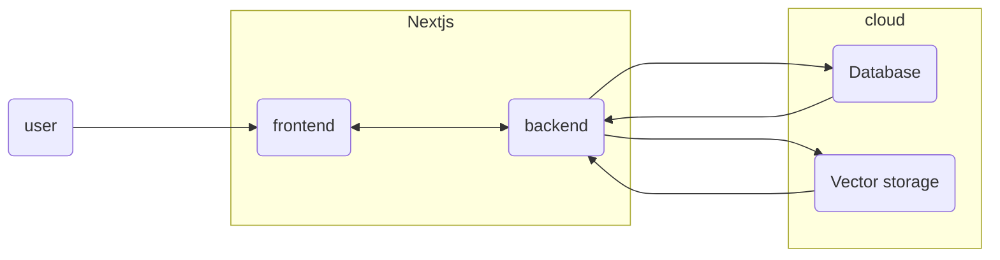
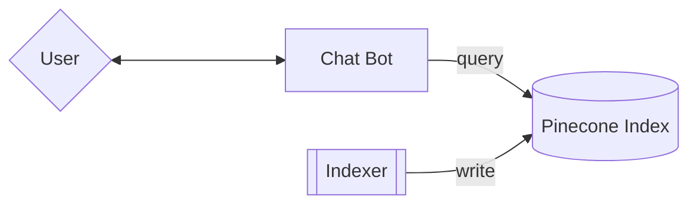
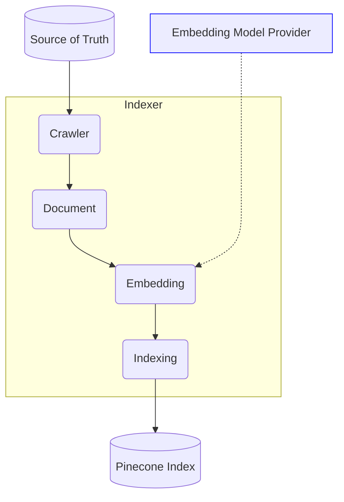

# AI Assistant

## Techstacks

- Nextjs (front-end, back-end, apis)
  - Typescript, tailwind, next-auth
- Database (PostgreSQL and prisma)
- Storages (vercel KV)
- Deployment (vercel.com)

## highlevel design



## demo app


## chatbot design

### Architecture

At a very high level, here’s the architecture for our chatbot:



<br/>

There are three main components: The **chatbot**, the **indexer** and the **Pinecone index**.

1. The **indexer** crawls the source of truth, generates vector embeddings for the retrieved documents and writes those embeddings to Pinecone
2. A user makes a query to the chatbot
3. The chatbot queries Pinecone for the source of true
4. The chatbot responds to the user.

### Indexer

Let’s take a deeper look at the Indexer:



The indexer’s role is to crawl our source of truth, call the embedding model provider to generate embeddings for each document and then index those documents in Pinecone. One important detail to mention here is that the quality of the data we get from our crawler will directly affect the quality of the results our chatbot produces, so it’s critical that our crawler is able to clean up the fetched data from our source of truth as much as possible.

## use prisma with vercel postges

```bash
pnpm prisma db push
pnpm prisma studio
```
